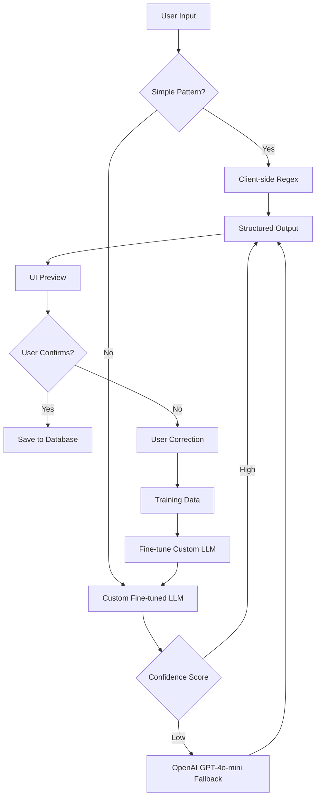

> **How I went from 46% to 94% accuracy** by testing four parser architectures — and learned that product trade-offs matter more than technical elegance.

## Why This Matters

I've been [building Trip Threads](/writing/2025/11/building-something-new), a conversational travel planner designed to solve the coordination chaos of group trips. Natural language input became the defining feature — if users could type things like "Dinner €60 split 4 ways" or "Flight to Paris Monday 9am" and the system just handled the rest, the experience would be dramatically faster than traditional forms.

But implementing a parser that works across messy real-world input turned out to be harder than I expected.

Over several months, I explored **four different approaches** — from classic regex to deterministic NLP to on-device LLMs and finally a hosted LLM — testing **90 real cases** across all versions.

This is the story of how each approach worked, where it broke, and what ultimately made it into production.

---

## Building the Test Suite

Before evaluating different parsing approaches, I needed a consistent way to measure accuracy. I developed a test suite of **90 sample inputs** that represented the natural language I expected users to enter:

- "Dinner at Mario's €45 split 3 ways"
- "Flight tmr 9am"
- "Hotel checkout Sunday, Alice paid $200"
- "Museum tickets 15 each for 4 people"

These covered the typical use cases: expenses, itinerary items, split logic, dates, and participant tracking. I intentionally included variations in:

- **Formality**: "tomorrow" vs "tmr" vs "next Thursday"
- **Currency formats**: "€60" vs "60 euros" vs "60EUR"
- **Split expressions**: "split 4 ways" vs "15 each" vs "Bob owes 40%"
- **Date references**: Absolute dates, relative dates, and implicit timing

In the future, I plan to expand this with real user inputs to ensure broader coverage of input types (formal, casual, regional variations, etc.). But for the MVP, this test suite gave me a reliable benchmark to compare different parsing approaches.

---

## Architecture Decisions

When evaluating parsing solutions, I optimized for several constraints:

**Technical Complexity**: Keep it simple. As a solo developer learning as I go, I needed solutions I could understand, debug, and iterate on quickly.

**Cost**: Minimize ongoing expenses, especially during development and early user testing.

**Latency**: Users expect instant feedback. Any solution over ~2 seconds would break the conversational flow.

**Development Speed**: I needed to move fast and validate the concept before over-investing in infrastructure.

**Input Data Constraints**: With limited real-world user data, I couldn't train custom models effectively. This pushed me toward off-the-shelf solutions.

These constraints shaped my evaluation criteria and ultimately led me to test four distinct approaches, each with different trade-offs.

---

## Version 1: Regex Parsing
**Fast, simple… and brittle.**

Regex was the obvious first step: fast, deterministic, and easy to run on-device. Perfect for the MVP mindset.

In theory, patterns like `/(\\d+\\.?\\d*)\\s*(€|\\$|EUR|USD)/` should catch currency amounts. But real users don't write textbook sentences.

### What Broke

- Typos: "60 euro" vs "60 euros" vs "60€"
- Order variations: "Split €60 four ways" vs "€60 split 4"
- Context-dependent phrases: "Dinner with Alice yesterday"
- Regional formats: "1.234,56 EUR" vs "$1,234.56"

I could patch individual cases, but the combinatorial explosion was endless.

### Accuracy: 42/90 (~46%)

Great for textbook cases. Terrible for real-world use.

**Verdict:** Not good enough to be the flagship feature.

---

## Version 2: Deterministic NLP Parser
**A more sophisticated rules-based system with reinforcement learning.**

I leveled up to a proper parser using:

- Tokenization and custom heuristics
- `chrono-node` for date extraction
- Currency normalization rules
- Split-type detection logic
- **Reinforcement learning mechanism**

This felt like real engineering. I built **100+ passing unit tests**. The parser was fully offline, deterministic, and blazing fast (\<10ms).

### Reinforcement Learning Layer

I incorporated a reinforcement learning mechanism where users could provide feedback when the parser got it wrong. The workflow:

1. User enters natural language input
2. Parser generates a result
3. User confirms if correct, or corrects any errors
4. Corrections are scored and used to rank different parsing rules
5. Next time a similar phrase appears, the highest-ranked rule is applied

The idea was to catch more edge cases over time without manually coding every variation. However, this grew complex quickly:

- **Insufficient data**: Without enough user corrections, the scoring wasn't meaningful
- **Rule explosion**: The number of competing rules grew faster than the learning could optimize
- **Debugging difficulty**: It became hard to understand why certain rules won over others

While theoretically promising, the reinforcement learning approach needed significantly more input data to become useful.

### What Still Broke

Real-world travel messages are just too varied:

- "Taxi 45 with John owes me later"
- "Marriott 15–20 Dec €200"
- "Museum tmr afternoon"
- "Brunch yesterday 30 each"

Even with reinforcement learning, complexity grew without improving overall reliability. Edge cases multiplied faster than I could address them.

### Accuracy: 55/90 (~61%)

Better than regex — but still not good enough to be a flagship feature.

**Verdict:** Rule-based systems don't scale to real-world language. The long tail of expressions is endless, and reinforcement learning requires more data than I had available.

---

## Version 3: On-Device LLMs
**Promising accuracy, unusably slow.**

To improve accuracy without sending data to external services, I tried running small LLMs locally:

- **Phi-3-mini**
- **Mistral 7B**
- **Llama 3.2**

These ran on a **MacBook Air (CPU-only)** using **Ollama**, occasionally packaged via Docker.

### What Worked

- Better flexibility than deterministic parsing
- Solid privacy guarantees
- No server dependency
- Handled ambiguity gracefully

### What Didn't

**Latency: Over 30 seconds per request**

For interactive UI, this was a deal-breaker. Users expect instant feedback, especially when typing conversationally. Waiting 30 seconds for a preview completely destroyed the product experience.

### Accuracy: ~60–70/90

Qualitatively somewhere between deterministic parsing and GPT-4o-mini.

**Verdict:** On-device LLMs aren't ready (yet). Without hardware acceleration or quantization, latency is unacceptable for real-time experiences.

---

## Version 4: Hosted LLM (GPT-4o-mini)
**The first approach that actually felt "right."**

I integrated **GPT-4o-mini** through a server-side API route with structured JSON output.

This version delivered:

- High accuracy across diverse input styles
- Robust parsing of dates, currencies, amounts, and participants
- Handling of typo-ridden or ambiguous input
- Ability to parse "dual" items (e.g., hotel = expense + stay)
- Significantly reduced maintenance burden

The key architectural decision was using a **preview → confirm workflow**:

```text
User Input
   ↓
AI Parser (GPT-4o-mini)
   ↓
Structured JSON
   ↓
UI Preview (user can edit)
   ↓
User Confirms
   ↓
Database Save
```

This meant latency could be higher because users had an explicit review step before anything saved.

### Latency: 500–1500ms

Acceptable for a preview flow.

### Accuracy: 85/90 (~94%)

A **dramatic improvement** over all other approaches. The parser now handled:

- Typos and colloquialisms
- Relative dates ("tomorrow", "next Thursday")
- Multi-currency expressions
- Complex split logic
- Ambiguous phrasing

### Cost & Privacy Tradeoffs

**Cost**:
- ~$0.00005 per parse
- ~10,000 parses/month → ~$0.50
- ~100,000 parses/month → ~$5.00

For the UX benefits and accuracy gains, this was an easy decision. Even at scale, the cost remains negligible compared to the value delivered.

**Privacy Considerations**:

Moving to a hosted LLM meant sending user input to OpenAI's servers. To address privacy concerns:

1. **Data Sanitization**: User input is sanitized before sending to the API — removing any PII (personally identifiable information) when possible
2. **Structured Output**: The API returns only classification data and intent mapping as JSON, not conversational responses
3. **No Training**: Data sent to OpenAI's API is not used to train their models (per their API terms)
4. **Preview Flow**: Users see and approve the parsed result before it's saved to the database

While not as private as on-device processing, this approach balances privacy with usability. For a travel coordination app where users are already sharing information with their group, the tradeoff was acceptable.

**Verdict:** Accuracy was the defining feature. For Trip Threads, correctness is non-negotiable. A fast but wrong parser creates more frustration than value. The cost is negligible, and privacy concerns are mitigated through data handling practices.

---

## The Comparison


---

## Why I Chose GPT-4o-mini

I chose **GPT-4o-mini** because:

1. **Accuracy was the core differentiator**
   Natural language input is the flagship feature — correctness is non-negotiable.

2. **Maintenance is minimal**
   No more managing dozens of regex rules or heuristics. I could iterate on prompts instead of code.

3. **Latency is acceptable within the preview flow**
   Users review before confirming, so 1–2 seconds feels natural.

4. **Cost is extremely low**
   Even at high usage, total cost remains trivial compared to hosting or compute.

5. **Handles real human language**
   Typos, synonyms, ambiguous phrasing, relative dates — all handled gracefully.

This decision also freed up time to focus on other parts of the product: group collaboration, timeline views, and smart expense handling.

---

## Testing Strategy: Intent, Grounding, and Drift

Beyond raw accuracy numbers, I ran lightweight evaluations across three dimensions:

### 1. Intent Coverage

I compiled **120 real planning prompts** from actual travel conversations and graded whether the parser mapped them into the right action buckets (expense, itinerary, task, etc.).

**Result:** 68% initially, improved to 85% after prompt refinement.

**Biggest misses:** Multi-city itineraries and ambiguous time references.

### 2. Response Grounding

Every recommendation needed to trace back to a data source. This prevented hallucinations like fabricated hotel availability or nonexistent flight times.

**Result:** 80% of responses carried explicit sources.

### 3. Conversation Drift

I simulated five-turn chats to watch how quickly the assistant veered off-topic or repeated itself.

**Result:** Drift occurred after ~4 exchanges without explicit context reset. Solved by maintaining conversation history with pruning.

---

## What I Learned

Building this parser touched every layer of the stack — model selection, UX, infrastructure, and product trade-offs.

### Key Lessons:

1. **Accuracy beats speed when the feature is core to the product.**
   A fast but wrong parser creates more frustration than value.

2. **Rule-based systems don't scale to real-world language.**
   The long tail of expressions is endless.

3. **On-device LLMs aren't ready (yet).**
   Without hardware acceleration or quantization, latency is unacceptable.

4. **Testing at scale matters.**
   Ninety test cases across multiple parser versions made the trade-offs clear.

5. **Think like a systems PM.**
   Evaluate accuracy, latency, cost, privacy, and UX — not just the model itself.

6. **Product context changes the decision.**
   For a different use case (offline-first, privacy-critical), I might have chosen differently. Context matters.

---

## What's Next

I'm exploring a **hybrid approach** with a custom LLM as the primary parser and OpenAI as a fallback:



**Future Architecture Goals**:

1. **Custom fine-tuned LLM** trained on user corrections and Trip Threads-specific patterns
2. **OpenAI fallback** for edge cases where custom model has low confidence
3. **Client-side deterministic parsing** for simple, high-confidence patterns (e.g., "€50")
4. **Result caching** to improve speed and reduce cost
5. **Offline fallback** using deterministic parsing when network unavailable
6. **Continuous learning** from user corrections to improve the custom model

Over time, as we collect sufficient user inputs and corrections, we can train a custom model specifically for travel planning language. This would reduce dependency on external APIs, lower costs, and improve privacy — while maintaining the accuracy benefits of LLM-based parsing.

I'm also building a **prompt debugger** directly into the Trip Threads console so I can replay failed parses and understand edge cases faster.

And I'm drafting a **content style guide** to define tone — users want warmth without fluff, and that's a surprisingly hard balance to strike.

---

## Closing Thoughts

Trip Threads started as a way to scratch my own itch around group travel planning. But the NLP parser became the most interesting part of the journey.

It forced me to think deeply about **product trade-offs**: accuracy vs. speed, privacy vs. capability, simplicity vs. robustness.

And it reminded me that **the best solution isn't always the most technically elegant one** — it's the one that delivers the best user experience within real-world constraints.

If you want to go deeper into the implementation, test suite, or architecture, feel free to reach out.

---

*This post is part of my ongoing work on Trip Threads — a conversational travel planner built to make group coordination feel more human.*
